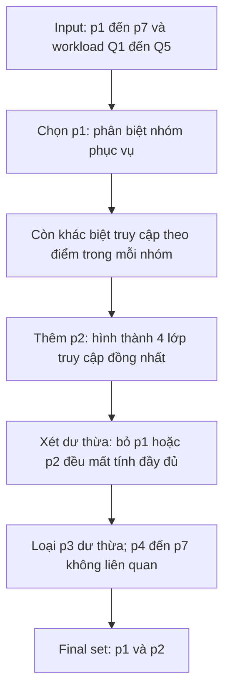

# Phase 6 — COM_MIN

## Mục tiêu, input và giả định

Máy thực hiện: Máy 1. Quan hệ: `QLSV_SITE1.dbo.QLSV`.
Input là bảy ứng viên p1–p7 và workload Q1–Q5 trong `predicates.md`.
Tần suất truy vấn và việc đọc mọi bản ghi thỏa điều kiện đều là giả định.
Chúng chưa được đo trên ứng dụng thực tế.

File chạy: `database/site1/08_com_min.sql`.
SQL trình bày và kiểm tra mô hình của bài này; không phải bộ phân tích
COM_MIN tổng quát cho SQL bất kỳ. Không tạo bảng fragment ở phase này.

## Cơ sở lý thuyết

Một tập predicate đầy đủ đối với workload khi các bản ghi thuộc cùng một
lớp phân chia có cách truy cập đồng nhất. Predicate có liên quan nếu việc
chia một lớp theo nó phân biệt được cách truy cập. COM_MIN chọn các
predicate có liên quan, bổ sung đến khi đầy đủ và xét lại tính dư thừa.
Tập tối thiểu không còn predicate nào có thể bỏ mà vẫn giữ tính đầy đủ.

Tham khảo: M. Tamer Özsu, [CS742 — Distributed Database Design, phần
primary horizontal fragmentation và COM_MIN](https://cs.uwaterloo.ca/~tozsu/courses/CS742/Course%20Notes/2-DistDesign.pdf).

Completeness ở đây là tính đầy đủ đối với workload. Kiểm tra mọi dòng dữ liệu
được phủ bởi các fragment là một yêu cầu khác, thực hiện ở phase phân mảnh.

## Cách truy cập của một bản ghi

Mỗi lượt chạy một query đọc mỗi bản ghi thỏa điều kiện một lần theo mô hình.
Vector `(a1, a2)` dưới đây là số lượt truy cập dự kiến mỗi ngày **trên một
bản ghi** từ Application 1 và 2, bao gồm Q5: `(2, 2)`.
Đây không phải số trang đĩa đọc hoặc số liệu hiệu năng thực tế.

| Lớp logic | Query lọc đọc bản ghi | Vector truy cập gồm Q5 |
|---|---|---|
| Hà Nội, TB >= 8 | Q1 | (40 + 2, 5 + 2) = (42, 7) |
| Hà Nội, TB < 8 | Q2 | (20 + 2, 5 + 2) = (22, 7) |
| Ngoài Hà Nội, TB >= 8 | Q3 | (5 + 2, 40 + 2) = (7, 42) |
| Ngoài Hà Nội, TB < 8 | Q4 | (5 + 2, 20 + 2) = (7, 22) |

Không cộng hai thành phần vector để xét relevance: ví dụ (42, 7) và
(7, 42) có cùng tổng nhưng đến từ hai ứng dụng khác nhau.

## Các bước COM_MIN cho bài này

1. Khởi đầu với một lớp toàn bộ quan hệ: chứa bốn vector nên chưa đầy đủ.
2. Chọn p1. Nó phân biệt nguồn truy cập ưu tiên giữa Hà Nội và ngoài Hà Nội.
   Tập `{p1}` vẫn chưa đầy đủ: trong Hà Nội, điểm 7 và điểm 8 có vector
   (22, 7) và (42, 7). Ngoài Hà Nội cũng còn khác biệt theo điểm.
3. Thêm p2. Bốn lớp mới có các vector như bảng trên. Mọi query Q1–Q4
   được xác định bởi p1/p2 hoặc phủ định của chúng; Q5 đọc tất cả.
   Bất kỳ hai bản ghi cùng giá trị chân lý p1 và p2 đều được cùng các query
   truy cập với cùng tần suất. Vì vậy `{p1, p2}` đầy đủ cho workload này.
4. Kiểm tra lại từng predicate đã chọn. Bỏ p1 sẽ gộp Hà Nội và ngoài Hà Nội
   cùng mức điểm, ví dụ (42, 7) với (7, 42). Bỏ p2 sẽ gộp hai nhóm điểm
   trong cùng quê quán, ví dụ (22, 7) với (42, 7). Cả hai phép bỏ đều làm
   một lớp chứa hai cách truy cập khác nhau. Vì vậy cả p1 và p2 đều cần thiết.
5. Xét các ứng viên còn lại theo bảng quyết định dưới đây.

| Predicate | Quyết định | Lý do |
|---|---|---|
| p1: QQ = Hà Nội | Giữ | Phân biệt nguồn truy cập của hai ứng dụng |
| p2: TB >= 8 | Giữ | Phân biệt tần suất đọc theo nhóm điểm trong mỗi vùng |
| p3: TB < 8 | Không thêm | `p3 = NOT p2` vì TB NOT NULL, không tạo thêm lớp |
| p4: QQ = TP. Hồ Chí Minh | Không thêm | Tách nhóm ngoài Hà Nội nhưng hai phía cùng query và tần suất khi cùng nhóm điểm |
| p5: GT = Nam | Không thêm | Đổi GT trong một lớp p1/p2 không đổi query hay vector |
| p6: NS >= 2005 | Không thêm | Đổi năm sinh trong một lớp p1/p2 không đổi query hay vector |
| p7: DT = Kinh | Không thêm | Đổi dân tộc trong một lớp p1/p2 không đổi query hay vector |

Kết luận: **Pr_min = {p1: QQ = N'Hà Nội', p2: TB >= 8}**.
Đây là tập tối thiểu theo nghĩa không bỏ được phần tử nào.
Nó không nhất thiết là cách biểu diễn duy nhất: `{p1, p3}` cũng tạo cùng
phân chia; ta giữ p2 theo thứ tự xét p1 rồi p2 để thống nhất các phase sau.
Nếu workload thay đổi, phải xét lại kết luận.

## Vì sao không suy ra từ 60 dòng seed?

Seed hiện có Q1 rỗng. Schema vẫn cho phép sinh viên Hà Nội đạt 8 điểm.
Nếu bỏ qua trường hợp hợp lệ đó, thiết kế sẽ phụ thuộc vào sự ngẫu nhiên
của dữ liệu hiện tại. Ví dụ hai bản ghi Hà Nội có TB = 7 và TB = 8
đều hợp lệ, dù bản ghi thứ hai chưa có trong seed.

SQL dùng 48 bản ghi đại diện trong biến bảng: ba quê quán (Hà Nội,
TP. Hồ Chí Minh, Đà Nẵng), hai điểm (7, 8), hai giới tính (Nam, Nữ),
hai năm sinh (2004, 2005), hai dân tộc (Kinh, Tày).
Các đại diện phủ mọi tổ hợp chân lý khả thi của p1–p7:
QQ có ba trường hợp vì Hà Nội và TP. Hồ Chí Minh không thể đồng thời đúng;
p3 luôn là phủ định của p2; các thuộc tính còn lại độc lập theo schema.
Mỗi giá trị khác hợp lệ thuộc cùng một lớp chân lý với một đại diện.
Các dòng này chỉ tồn tại trong biến bảng của batch, không được chèn vào dbo.QLSV.

## Chạy, kết quả và điều kiện hoàn thành

Mở `08_com_min.sql` trong SSMS trên Máy 1, Execute toàn bộ file.

| Tập kiểm tra | Số lớp | Số lớp có nhiều kiểu truy cập |
|---|---:|---:|
| Rỗng | 1 | 1 |
| Chỉ p1 (bỏ p2) | 2 | 2 |
| Chỉ p2 (bỏ p1) | 2 | 2 |
| p1, p2 | 4 | 0 |
| p1, p2, p3 | 4 | 0 |
| p1, p2, p4 | 6 | 0 |
| p1, p2, p5 | 8 | 0 |
| p1, p2, p6 | 8 | 0 |
| p1, p2, p7 | 8 | 0 |

Thêm p4–p7 làm tăng số lớp nhưng chỉ chia các lớp đã đồng nhất truy cập.
Kết quả tiếp theo hiển thị bốn vector và số dòng thực tế `0, 10, 25, 25`.
Kết quả cuối kiểm tra p3 là phủ định p2 trên dữ liệu hiện tại: 0 vi phạm.

Nếu số lớp mô hình khác bảng này, cần kiểm tra script và tần suất workload.
Nếu chỉ số dòng thực tế khác, đối chiếu dữ liệu đã thêm/sửa kể từ Phase 4.
Nếu SSMS báo lỗi bảng không tồn tại, kiểm tra instance và database.

Chỉ chốt Phase 6 khi script chạy thành công, kết quả được đối chiếu và
hiểu lý do giữ/loại từng ứng viên. Phase 7 sẽ đặt tên và xét các minterm.
