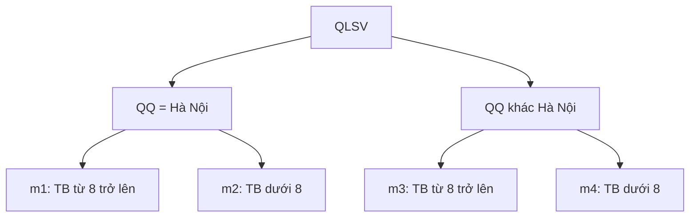

# Phase 7 — Minterms

## Mục tiêu và input

Thực hiện trên Máy 1, database `QLSV_SITE1`, sau Phase 6 đã kiểm tra thành công.
Tập predicate đã chốt theo workload giả định:

```text
p1: QQ = N'Hà Nội'
p2: TB >= 8
```

Minterm là một phép AND chứa mỗi predicate đúng một lần, ở dạng khẳng định
hoặc phủ định. Với hai predicate, liệt kê 2^2 = 4 tổ hợp rồi xét tính khả thi.
QQ và TB đều NOT NULL, do đó `NOT p1` tương đương `QQ <> N'Hà Nội'`,
`NOT p2` tương đương `TB < 8`. Quy tắc so sánh chuỗi theo collation của database.

## Bảng minterm chính thức

| ID | p1 | p2 | Biểu thức | Điều kiện SQL | Query tương ứng |
|---|---|---|---|---|---|
| m1 | Đúng | Đúng | p1 AND p2 | `QQ = N'Hà Nội' AND TB >= 8` | Q1 |
| m2 | Đúng | Sai | p1 AND NOT p2 | `QQ = N'Hà Nội' AND TB < 8` | Q2 |
| m3 | Sai | Đúng | NOT p1 AND p2 | `QQ <> N'Hà Nội' AND TB >= 8` | Q3 |
| m4 | Sai | Sai | NOT p1 AND NOT p2 | `QQ <> N'Hà Nội' AND TB < 8` | Q4 |



Các nhánh thể hiện điều kiện logic. Phase 8 mới tạo bảng fragment từ các điều kiện này.

## Contradiction, implication và redundancy

| Minterm | Một ví dụ hợp lệ theo schema (QQ, TB) | Kết luận |
|---|---|---|
| m1 | Hà Nội, 8.00 | Khả thi |
| m2 | Hà Nội, 7.99 | Khả thi |
| m3 | Đà Nẵng, 8.00 | Khả thi |
| m4 | Đà Nẵng, 7.99 | Khả thi |

Các ví dụ có thể mở rộng thành bản ghi hợp lệ bằng MA riêng, HT, NS = 2004,
GT = Nam, DT = Kinh. Vì vậy không minterm nào mâu thuẫn với schema.

- **Contradiction:** `TB >= 8 AND TB < 8` hoặc `QQ = N'Hà Nội' AND
  QQ <> N'Hà Nội'` luôn sai. Không tổ hợp nào trong m1–m4 chứa các cặp đó.
- **Implication:** schema không quy định quan hệ phụ thuộc giữa quê quán và
  điểm. Bốn ví dụ trên bác bỏ việc dùng một giá trị chân lý của p1 để suy ra
  p2 hoặc phủ định p2, và ngược lại. Quan hệ `p3 = NOT p2` đã được xử lý
  ở COM_MIN; p3 không phải chiều độc lập để sinh tám tổ hợp.
- **Redundancy:** bốn minterm có bốn cặp chân lý khác nhau, không trùng nhau.
  Mỗi minterm có ví dụ hợp lệ; loại bất kỳ minterm nào sẽ bỏ sót ví dụ đó.
- **Ý nghĩa:** m1–m4 tương ứng Q1–Q4 của workload. m1 hiện không có dòng
  trong seed, nhưng vẫn có ý nghĩa truy vấn và vẫn phải giữ.

## Phủ toàn bộ và không giao nhau về mặt logic

Vì QQ, TB không NULL, mỗi predicate nhận đúng một trong hai giá trị đúng/sai.

```text
m1 OR m2 OR m3 OR m4
= (p1 OR NOT p1) AND (p2 OR NOT p2)
= TRUE
```

Hai minterm khác nhau luôn trái dấu ở ít nhất một predicate, nên không bản ghi
nào thỏa cả hai. Đây là lập luận cho các điều kiện phân chia; các bảng fragment
vật lý và reconstruction qua hai site vẫn phải kiểm tra ở những phase sau.

Điểm 8.00 thuộc m1 hoặc m3; 7.99 thuộc m2 hoặc m4. Điểm 0 và 10 vẫn thuộc
miền hợp lệ. Các quê quán khác Hà Nội đều thuộc nhánh NOT p1, kể cả địa danh
chưa xuất hiện trong seed.

## Chạy SQL trên Máy 1

Mở `database/site1/09_minterms.sql` trong SSMS, kết nối Site 1 và Execute toàn file.
Script đọc dbo.QLSV một lần vào biến bảng để các thống kê dùng cùng tập bản ghi.
Các ví dụ kiểm tra biên chỉ nằm trong biến bảng, không thêm vào dữ liệu sinh viên.

Với bộ seed hiện tại, mong đợi bốn nhóm kết quả:

1. Bảng minterm: m1 = 0, m2 = 10, m3 = 25, m4 = 25 dòng.
2. Tổng hợp: TotalStudents = 60, TotalMatches = 60, MissingStudents = 0,
   OverlappingStudents = 0.
3. Danh sách sinh viên thỏa số minterm khác 1: **0 dòng**.
4. Mười trường hợp biên: tất cả có Status = PASS. Trong đó Hà Nội, TB = 8
   và TB = 10 thuộc m1, chứng minh trường hợp m1 hợp lệ trong mô hình kiểm tra.

Chỉ so sánh tổng số dòng là chưa đủ: số dòng thiếu và số dòng giao nhau có thể
bù nhau. Vì vậy script đếm số minterm thỏa riêng cho từng MA.

## Lỗi thường gặp và điều kiện hoàn thành

- m1 có 0 dòng là kết quả đúng trên seed hiện tại, không phải contradiction.
- Nếu có MissingStudents hoặc OverlappingStudents, dừng và kiểm tra điều kiện,
  dữ liệu NULL hoặc thay đổi schema trước khi sang Phase 8.
- Nếu số đếm khác dự kiến nhưng mỗi MA vẫn thuộc đúng một minterm, đối chiếu
  dữ liệu được thêm/sửa kể từ Phase 4.
- Nếu không tìm thấy bảng, kiểm tra instance, database và các script Phase 3.
- Khi thử dữ liệu tiếng Việt, dùng literal có tiền tố `N`.

Phase 7 hoàn thành khi bốn nhóm kết quả khớp dự kiến, hiểu vì sao giữ cả m1
và thống nhất bảng minterm làm đầu vào Phase 8 — Horizontal Fragmentation.
Trước khi kiểm thử fragment thực tế, vẫn cần bổ sung seed phủ m1 như đã ghi
ở Phase 5; các ví dụ trong biến bảng không thay thế dữ liệu tích hợp đó.
